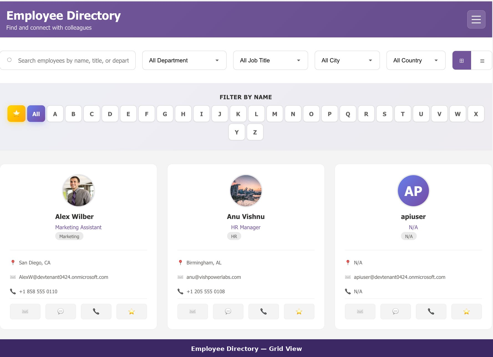
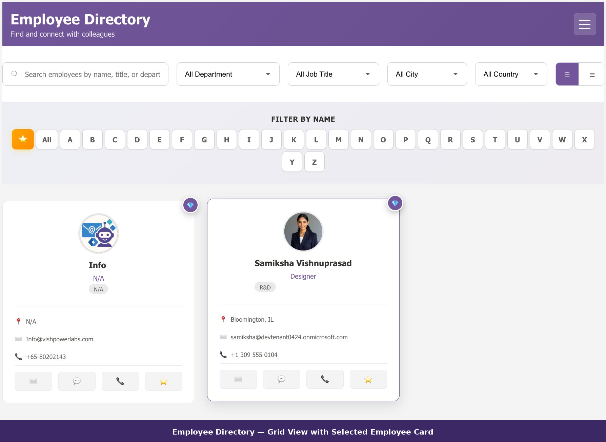
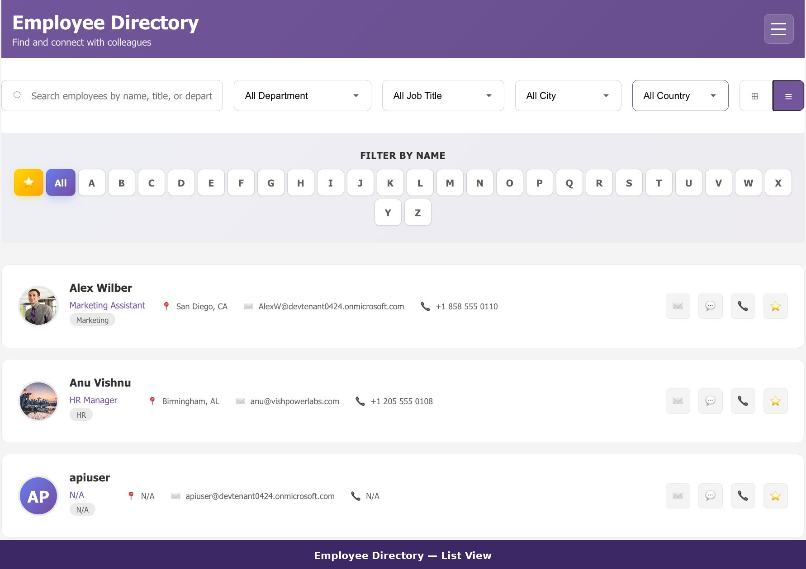
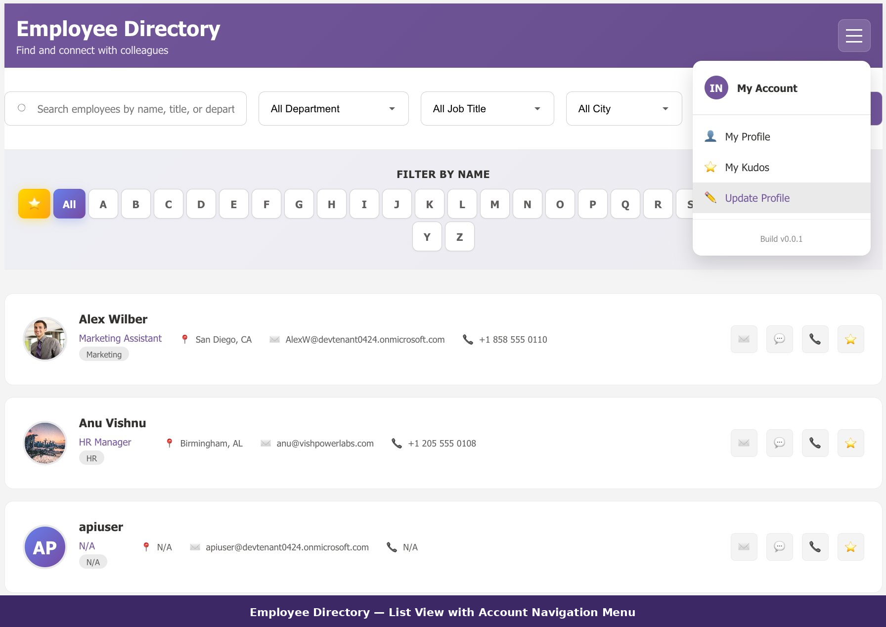
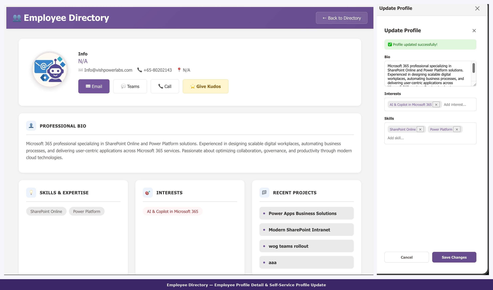

# Modern Employee Directory

A SharePoint Framework (SPFx) web part that delivers a fast, modern employee directory experience inside SharePoint Online and Microsoft Teams — powered by Microsoft Graph API.

---

## Features

### Layout & Display
- Grid and List views with switchable layouts
- Profile viewing styles — Classic Scrolling, Modern Tabbed, or Modal Overlay
- Org chart visualisation — Vertical Tree, Horizontal Tree, or Compact List
- Adjustable container margins, badge sizes, and font sizes to match your branding
- Full theme support including dark mode and high contrast

### Search & Filtering
- Live search by name, department, or job title
- Scope the directory by Department, Office Location, Email Domain, or Extension Attribute
- On-page dropdown filters for Department, Office Location, Job Title, City, State, and Country
- Pagination via Load More or Previous / Next with configurable page size (5–50 users)

### Kudos & Recognition
- Peer-to-peer Kudos system with badge types and messages
- Data stored in a configurable SharePoint list with column mapping
- Hall of Fame dashboard — auto-populate by Kudos threshold or manually pin featured people

### Self-Service Profile Updates
- Employees can update their own profile directly from the web part
- Admins control which fields are editable: Job Title, Bio, Mobile, Office Location, Skills, Interests, Past Projects

### Audit Logging
- Track directory interactions and profile update activity to a SharePoint list
- Captures Activity Type, Actor, Target, and JSON detail payload
- Debug panel for on-page audit diagnostics

### Microsoft Teams Ready
- Works as a SharePoint web part, Full Page App, Teams Personal App, and Teams Tab
- Real-time Teams presence indicators via Graph API

---

## Screenshots

### Grid View

### Grid View — Selected Card

### List View

### List View — Account Menu

### Profile Panel & Update

---

## Prerequisites

- SharePoint Online tenant
- Microsoft 365 with Graph API access
- Node.js >= 22.14.0
- SPFx 1.22.0

---

## Toolchain

| Tool | Version |
| :--- | :--- |
| SPFx | 1.22.0 |
| Node.js | 22.x |
| React | 17.0.1 |
| Fluent UI React | 8.x |
| PnP JS | 4.x |
| TypeScript | 5.8.x |
| Build | Rush Stack Heft |

> Built and bundled using the SPFx Heft build rig (`@microsoft/spfx-web-build-rig`).

---

## Installation

1. Download the `.sppkg` file from the [Releases](https://github.com/vishpowerlabs/ModernEmployeeDirectory/releases) page.
2. Upload to your **SharePoint App Catalog**.
3. Deploy the solution and approve the required Graph API permissions in the SharePoint Admin Center under **API access**.
4. Add the web part to any SharePoint page or Teams tab.

---

## Graph API Permissions

Approve the following in SharePoint Admin Center under **API access**:

| Permission | Purpose |
| :--- | :--- |
| `User.Read.All` | Query the directory, managers, and direct reports |
| `User.ReadWrite` | Allow users to self-update profiles, skills, and interests |
| `Presence.Read.All` | Show real-time Teams presence |
| `People.Read.All` | Populate colleague and people suggestions |

---

## Configuration

The property pane is split across three pages.

### Page 1 — General

| Setting | Description |
| :--- | :--- |
| **Description** | Header text for the web part instance |
| **Container Margin** | Outer margin 0–30px |
| **Badge Circle Size** | Avatar badge size 20–60px |
| **Badge Font Size** | Initials font size 8–20px |
| **Profile Viewing Style** | Classic Scrolling, Modern Tabbed, or Modal Overlay |
| **Org Chart Layout** | Vertical Tree, Horizontal Tree, or Compact List |
| **Homepage Title Font Size** | 20–40px |
| **Detail Page Title Font Size** | 16–32px |
| **Section Heading Font Size** | 12–24px |
| **Enable Pagination** | Toggle pagination on or off |
| **Users per Page** | 5–50 users per page |
| **Pagination Style** | Load More or Previous / Next |

### Page 2 — Directory Features

| Setting | Description |
| :--- | :--- |
| **Filter Type** | None, Department, Office Location, Email Domain, or Extension Attribute |
| **Filter Value** | Contextual value based on filter type selected |
| **Home Page Dropdown Filters** | User-facing filters: Department, Location, Job Title, City, State, Country |
| **Enable Kudos** | Toggle the Kudos recognition system |
| **Min Kudos for Hall of Fame** | Threshold (0–20) for automatic Hall of Fame inclusion |
| **Select Kudos List** | SharePoint list for storing Kudos data |
| **Kudos Column Mapping** | Map Recipient, Author, Message, and Badge Type columns |
| **Manually Featured People** | Pin specific people to the top of the directory |

### Page 3 — Advanced

| Setting | Description |
| :--- | :--- |
| **Updatable Profile Fields** | Fields users can self-edit: Job Title, Bio, Mobile, Office Location, Skills, Interests, Past Projects |
| **Enable Audit Logging** | Toggle audit trail on or off |
| **Select Audit List** | SharePoint list for audit records |
| **Audit Column Mapping** | Map Activity, Actor, Target, and Details columns |
| **Show Audit Debug Panel** | Display raw audit data on the web part for diagnostics |

---

## 💬 Community & Feedback

This project is evolving with real-world usage — your input matters. If you find it useful, please star the repo.

### 💡 Start a Discussion

Have ideas, architecture questions, or want to share how you're using this in your organisation?

👉 Use **GitHub Discussions** to:
- Ask implementation questions
- Share customisations or extensions
- Propose new features
- Discuss best practices for SPFx + Graph

Start here: https://github.com/vishpowerlabs/ModernEmployeeDirectory/discussions

---

### 🐞 Report Issues or Request Features

Found a bug or something not working as expected?

👉 Open an Issue: https://github.com/vishpowerlabs/ModernEmployeeDirectory/issues

Include:
- Steps to reproduce
- Screenshots (if applicable)
- Environment details (Tenant, SPFx version, etc.)

---

### ⭐ Share Feedback / Real Usage

Using this in production or a POC?
- Drop a comment on the blog: https://www.wrvishnu.com/modern-employee-directory-sharepoint/
- Share what worked (or didn't)
- Suggest improvements

Real-world feedback directly shapes the roadmap.

---

### 🙌 Contribute Ideas (Even Without Code)

Not a developer? No problem.

You can still contribute by:
- Suggesting UX improvements
- Reporting edge cases
- Voting on features in Discussions
- Sharing use cases from your organisation

---

## License

MIT — see [LICENSE](LICENSE) for details.

---

*Built by [Vishpowerlabs](https://vishpowerlabs.com) · Blog: [wrvishnu.com](https://wrvishnu.com)*
